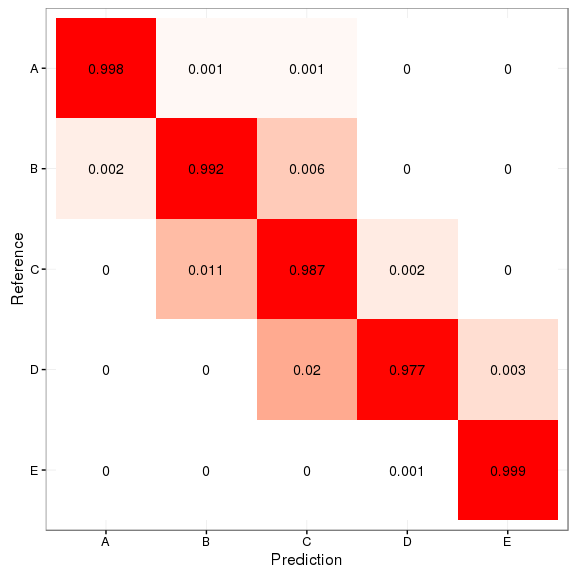

#Prediction Assignment: Weigth Lifting Exercises
##Introduction

Before starting the data analysis, we need to consider the components of a prediction:

Question:
Can we determine how well a 'unilateral dumbbell biceps curl' was done with the use of sensors?

Input data/features:
Data from sensors on the arm, forearm, belt and dumbbell.

The data will first be cleaned, before the separate data sets will be made to base our model on. Cross validation will be used to determine the out of sample error.

##Importing and cleaning data

First the used packages need to be loaded.


```r
#Loading needed packages
library(ggplot2)
library(dplyr)
library(caret)
library(randomForest)
```

To start of we need to load the give datasets into R. We will also check the structure. (Note that the train and test set will be named differently, since the "pml-testing.csv" will not be used as a test set for this project)


```r
#Importing data
#Structure of data now in .html file, since iti s a very large list
data <- read.csv("pml-training.csv")
assignment <- read.csv("pml-testing.csv")
str(data)
```

It is clear that some variables are noted as factors, but should be numerical/integer. 

It shouldn't matter for integers if they are numeric for the prediction we are going to do, so all the values that aren't numeric from the sensor measurements will be made numeric. Values like "" and "#DIV/0!" will be set as NA automatically.


```r
#For all data from sensors (columns 8 - 159, if the variable isn't numeric, 
#we will set it as numeric)
for (i in 8:159) {
  if (class(data[,i]) != "numeric") {
    data[,i] <- as.numeric(as.character(data[,i]))
  }
}

#Same for the test dataset
for (i in 8:159) {
  if (class(assignment[,i]) != "numeric") {
    assignment[,i] <- as.numeric(as.character(assignment[,i]))
  }
}
```

Many columns contain (almost) only NA values, some of these do have some values but only for when the "new_window" variable equals "yes". Since none of this kind of data is found in the 20 observations given in the assignment dataset, these should probably be removed.


```r
#Only keep observations where new_window = no. Uses dplyr's filter()
data <- filter(data, new_window == "no")
#Also done on assignment, since processing should be equal, but we know already
#that new_window always equals "no" here
assignment <- filter(assignment, new_window == "no")
```


```r
#Because of the amount of data, it would be best to only keep columns with no NA 
#because those can't be used for machine learning (and most columns with NA values 
#seem to have over 19000, making them very useless for mahcine learning even if we 
#try to transform it somehow)
x <- 0
usable <- numeric()
for (i in 1:160) {
  if (sum(is.na(data[,i])) == 0) {
    x = x + 1
    usable[x] = i
  }
}

data <- data[,usable]
assignment <- assignment[,usable]
```

Check if assignment dataset does not include NA values when using the same columns. Since it is a huge dataset, it is easier to confirm this by code.


```r
x <- 0
usable.assignment <- numeric()
for (i in 1:60) {
  if (sum(is.na(assignment[,i])) == 0) {
    x = x + 1
    usable.assignment[x] = i
  }
}

#Since there are 60 variables left, useable.assignment should contain 60 values
length(usable.assignment)
```

```
## [1] 60
```

Remove first 7 columns, since these do not include predictors.


```r
#The first 7 columns contain data that we can not use as predictors
data <- data[,8:60]
assignment <- assignment[,8:60]
```

##Cross validation

Cross validation was done by building a seperate test set using **createDataPartition()**. 70% of the given training set was used for the actual training set here, the other 30% as a test set to measure **the out of sampele error**. Defaults of this command were used and can be found by reading the documentation (?createDataPartition).

The assignment itself is somewhat odd. We are dealing with time series, but the given test set (named "assignment" here) contains single data points of the data, not windows of a certain amount of time. Because of this random sampling was used, without use of chunks - which would be more common for time series data.

Only two sets (train and test; assignment wasn't used for creating/validating the model) of the data were made. Since the assignment only asks for prediction and not interpretation, I did not try to only consider the most important predictors. When doing this, one would need a third set, but in this case it was not needed.


```r
#Setting seed so if used again, train and test set will be the same
set.seed(29848)
#Putting 70% of data in train set, rest in test
inTrain <- createDataPartition(data$classe, p = 0.7, list = FALSE)
train <- data[inTrain,]
test <- data[-inTrain,]
```

##Preprocessing

All the sensor data is centered and scaled to make sure it is as close to a normal distribution as possible. Of course, the preprocessing used for the train set will be applied on the other data sets aswell.


```r
#Standardizing sensor data
preproc <- preProcess(train, method = c("center", "scale"))
s.train <- predict(preproc, newdata = train)

#Using same preprocessing for the test set and the assignment data
s.test <- predict(preproc, newdata = test)
s.assignment <- predict(preproc, newdata = assignment)
```

##Model fitting

To start, I try to use a simple model using the package "rpart" to create a tree to use to predict the "classe" variable.


```r
set.seed(674)
tree <- train(classe ~ ., data = s.train, method = "rpart")
```

```
## Loading required package: rpart
```

```r
pred <- predict(tree, newdata = s.train)
confusionMatrix(pred, s.train$classe)$overall[1:2]
```

```
##  Accuracy     Kappa 
## 0.4949825 0.3394262
```

```r
pred.test <- predict(tree, newdata = s.test)
confusionMatrix(pred.test, s.test$classe)$overall[1:2]
```

```
##  Accuracy     Kappa 
## 0.4978310 0.3437141
```

The accuracy for both the train and test is about 0.5, pretty low. Since in this assignment the prediction is more important than the interpretation, I will use random forests.


```r
set.seed(8188)
#number of trees (ntree) was arbitrarily chosen, but worked well, while keeping
#the computing time low
randomforest <- randomForest(classe ~ ., data = s.train, ntree = 50)
pred <- predict(randomforest, newdata = s.train)
cm.train <- confusionMatrix(pred, s.train$classe)
cm.train$overall[1:2]
```

```
## Accuracy    Kappa 
##        1        1
```

```r
pred.test <- predict(randomforest, newdata = s.test)
cm.test <- confusionMatrix(pred.test, s.test$classe)
cm.test
```

```
## Confusion Matrix and Statistics
## 
##           Reference
## Prediction    A    B    C    D    E
##          A 1637    2    0    0    0
##          B    2 1106   11    0    0
##          C    2    7  992   19    0
##          D    0    0    2  922    1
##          E    0    0    0    3 1057
## 
## Overall Statistics
##                                           
##                Accuracy : 0.9915          
##                  95% CI : (0.9888, 0.9937)
##     No Information Rate : 0.2847          
##     P-Value [Acc > NIR] : < 2.2e-16       
##                                           
##                   Kappa : 0.9892          
##  Mcnemar's Test P-Value : NA              
## 
## Statistics by Class:
## 
##                      Class: A Class: B Class: C Class: D Class: E
## Sensitivity            0.9976   0.9919   0.9871   0.9767   0.9991
## Specificity            0.9995   0.9972   0.9941   0.9994   0.9994
## Pos Pred Value         0.9988   0.9884   0.9725   0.9968   0.9972
## Neg Pred Value         0.9990   0.9981   0.9973   0.9955   0.9998
## Prevalence             0.2847   0.1935   0.1744   0.1638   0.1836
## Detection Rate         0.2841   0.1919   0.1721   0.1600   0.1834
## Detection Prevalence   0.2844   0.1942   0.1770   0.1605   0.1839
## Balanced Accuracy      0.9985   0.9946   0.9906   0.9880   0.9992
```

This gives us an accuracy of 1.00 in the train set and 0.9915 in the test set, meaning there is some overfitting, but even in the test set the accuracy is really high.

##Out of sample error

We have seen that the accuracy and kappa value in the test set are both very high (0.9915 and 0.9892 respectively). 
Meaning the model has a substantially small out of sample error.

##Heatmap


```r
#Taking data from the confusion matrix for the test set
hm <- data.frame(cm.test$table)
max.values <- summary(s.test$classe)
#Values by proportion
hm <- mutate(hm, prop = Freq / max.values[as.character(Reference)])
#Reordering the reference value, so the heatmap looks more intelligible
hm$Reference = with(hm, factor(Reference, levels = rev(levels(Reference))))

ggplot(hm, aes(Prediction, Reference, label = round(prop, 3))) + 
  #Using the log of the frequency for the color, so low values get colored too
  geom_tile(aes(fill = log10(prop))) + 
  geom_text() +
  #set na.valie to white, because log(0) would be problematic
  scale_fill_gradient(low = "white", high = "red", guide = "none", na.value = "white") +
  theme_bw()
```

 
